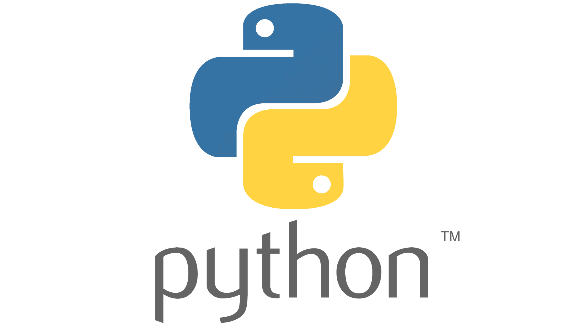
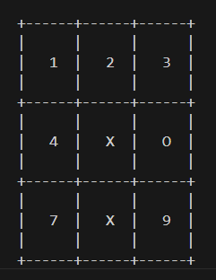

# Des mini projet en Python

## Description

Ci-joints des mini projet dévélopper en python 

## Langages utilisés

- Python

### 01: X O Toe
Mini jeu de [X O Toe](./XOTOE/XOToe.py)
##### Capture d'écran

### 02: Pierre Ciseau Feuille
Mini jeu de [Pierre Ciseau Feuille](./pcf/pcf.py)
##### Capture d'écran

### 03: Jour d'une année
Mini app de [doy](./doy/doy.py)
